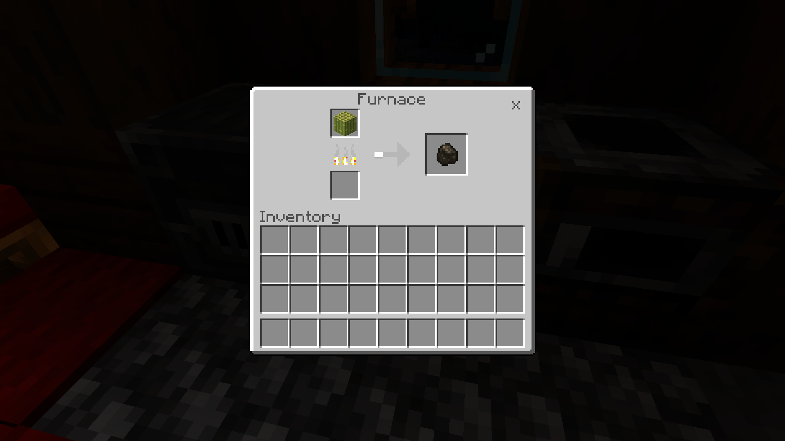
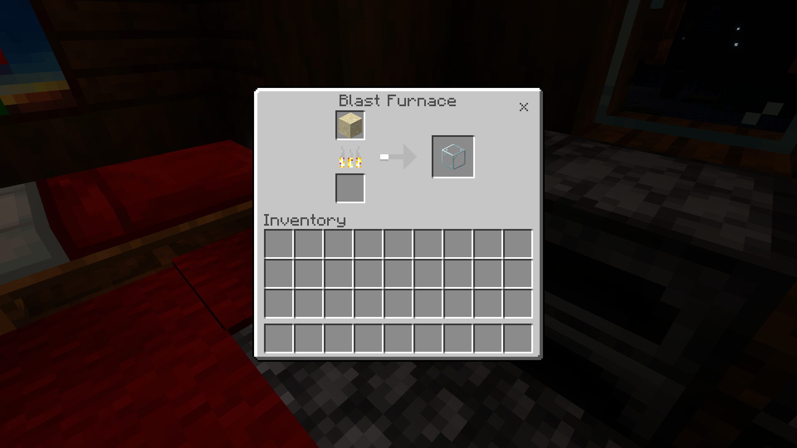
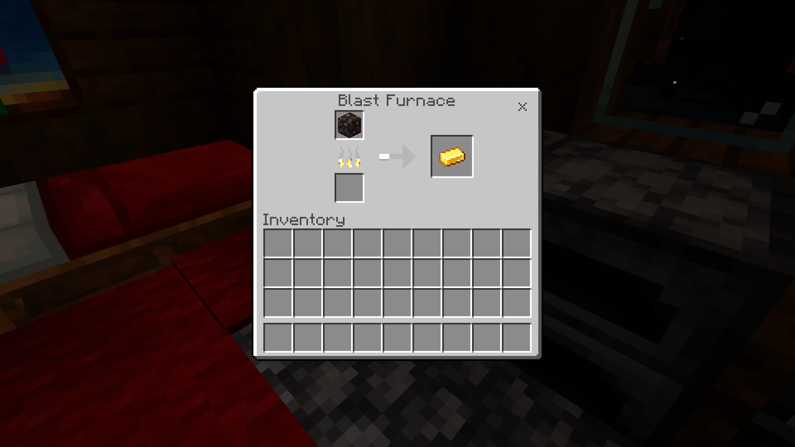
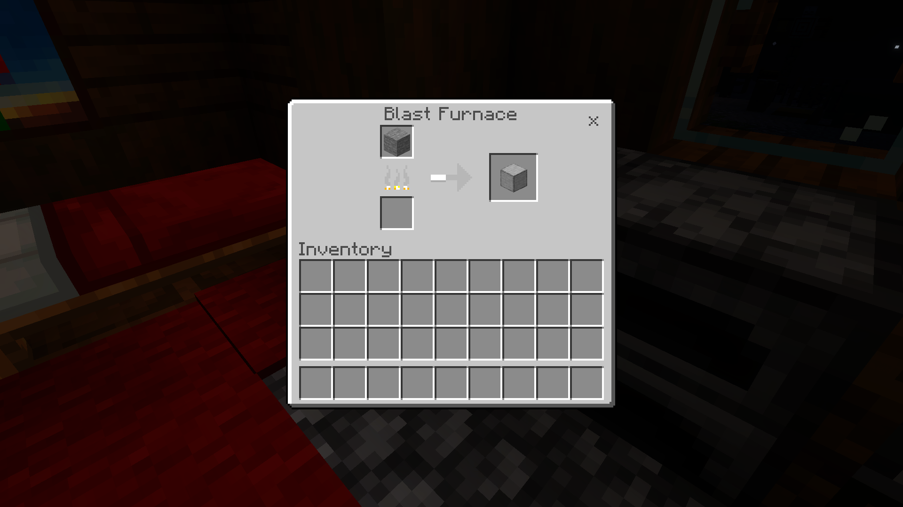
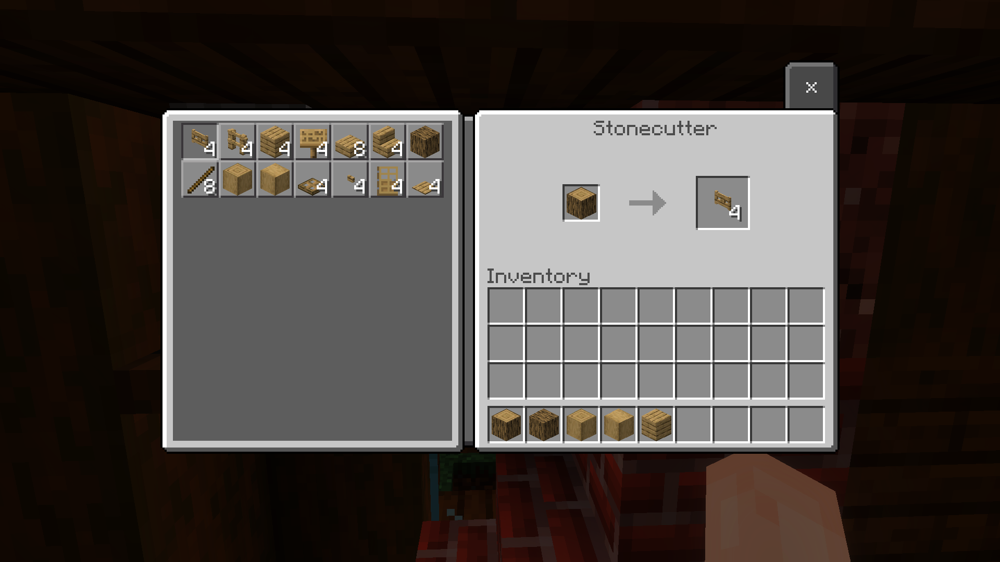
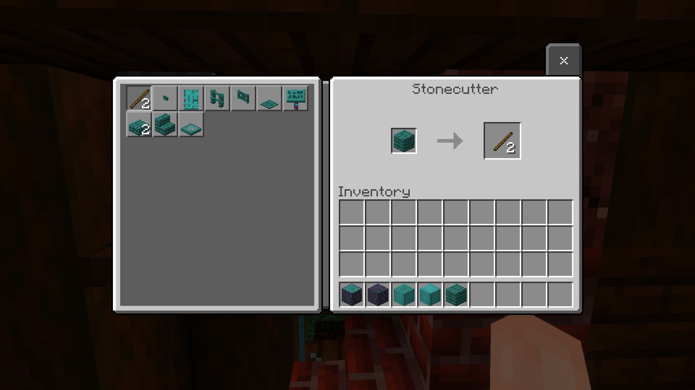

# QoF v1.1.0's Changelog

> [!NOTE]
> A Minecraft Bedrock addon that adds small vanilla-friendly features. Each module is configurable through the in-game pack settings panel. Requires **BetaAPIs** enabled under Experiments.

## Pack Info

Full changelog: [v1.1.0](https://github.com/aitji/QoL-BP/commits/v1.1.0) Releases: [v1.1.0](https://github.com/aitji/QoF/releases/tag/v1.1.0) LICENSE: [MIT](https://raw.githubusercontent.com/aitji/QoF/39f72183e57707f080931bb3fb5f760084ffdf5f/LICENSE)\
Release Date: [Mar/16/2026 (16:02:20)](https://time.is/Unix_time_converter/1773676940)

Base Game Version: [26.3](https://feedback.minecraft.net/hc/en-us/articles/43861703542925-Minecraft-Bedrock-Edition-26-3-Changelog)\
Dependacy: [2.6.0@beta](https://www.npmjs.com/package/@minecraft/server/v/2.6.0-beta.1.26.3-stable)

## Table of Contents

- [QoF v1.1.0's Changelog](#qof-v110s-changelog)
  - [Pack Info](#pack-info)
  - [Table of Contents](#table-of-contents)
  - [Changelogs](#changelogs)
    - [Dynamic Light](#dynamic-light)
    - [Anvil Repairing](#anvil-repairing)
    - [Wet Concrete Powder](#wet-concrete-powder)
    - [Composter+](#composter)
    - [Mob Loot+](#mob-loot)
      - [1. Goat Drop `Raw Mutton`](#1-goat-drop-raw-mutton)
      - [2. Silverfish Drop `String`](#2-silverfish-drop-string)
    - [Recipe+](#recipe)
      - [1. Bamboo Block to Charcoal (`Furnace`)](#1-bamboo-block-to-charcoal-furnace)
      - [2. Sand to Glass (`Blast Furnace`)](#2-sand-to-glass-blast-furnace)
      - [3. Gilded Blackstone to Gold Ingot (`Blast Furnace, Furnace`)](#3-gilded-blackstone-to-gold-ingot-blast-furnace-furnace)
      - [5. Stone to Smooth Stone (`Blast Furnace`)](#5-stone-to-smooth-stone-blast-furnace)
      - [6. Cobblestone to Stone (`Blast Furnace`)](#6-cobblestone-to-stone-blast-furnace)
      - [7. Charcoal to Coal Block (`Crafting Table`)](#7-charcoal-to-coal-block-crafting-table)
      - [8. **Stone** in Stonecutter](#8-stone-in-stonecutter)
      - [9. **Wood** in Stonecutter](#9-wood-in-stonecutter)
  - [License](#license)
  - [Credits](#credits)

## Changelogs

> [!NOTE]
> Dev Note: This is a first release of **Quality of Feature**, hope you enjoy!

### Dynamic Light

1. Move from pure Dynamic Property and `Set()` to get more performance, following `light, frame, chuck_unload`
2. light level with offhand will calculated with $\min\left(15,\ \left\lceil REDUCE\_LIGHT \cdot \sqrt{a^2 + b^2} \right\rceil\right)$
3. Spread light will correctly check block and won't goes throught blocks
4. Add Glow Entity that will emit light
5. tracking `Item Frame` for being place & destory, and will display light level correctly base on item that got display

Dynamic Light Table: [v.1.1.0](https://github.com/aitji/QoF/blob/8ecf100412e4478ca34d6fe61cf589f4a6cef416/scripts/_config.js#L12-L66)

### Anvil Repairing

1. Anvil can be repair by cosume _1 Iron Ingot_
2. Allow Player to held click to repar the anvil, even anvil repaired UI won't popup until stop `(nice UX touch)`
3. Ensure edge case for iron ingot not being cosume, anvil might roll-back to old state

### Wet Concrete Powder

1. wetDelay has been implement with formula is $final = 60 + \lfloor 10\sqrt{amount - 1} \rfloor$
2. track concrete powder when entity spawn/remove
3. kept tracking item entity velocity
4. batching the loop with BATCH_SIZE limit per tick

### Composter+

1. composter custom item vanilla logic
2. edge case handling for inventory un-sync
3. bowl return on `soup/stew` item
   Table Here

Compostable Table: [v1.1.0](https://github.com/aitji/QoF/blob/8ecf100412e4478ca34d6fe61cf589f4a6cef416/scripts/_config.js#L114-L199)

### Mob Loot+

Add mob loot to the unlootable mob

#### 1. Goat Drop `Raw Mutton`
$$ P(drop) \in \langle 1, 2 + L \rangle, \quad L \in \langle 0, \text{Looting} \rangle $$

<div align="center">

| Looting Level | Min Drop | Max Drop |
|---|---|---|
| None | 1 | 2 |
| I | 1 | 3 |
| II | 1 | 4 |
| III | 1 | 5 |

</div>

> **Goat Fire** will cooked `Raw Mutton` to `Cooked Mutton`

#### 2. Silverfish Drop `String`
$$P(drop) = \frac{1}{5} = 20\%$$

<div align="center">

| Outcome | Weight | Chance |
|---|---|---|
| Nothing | 4 | 80% |
| `String` | 1 | 20% |

</div>

> Only drops when killed by **player or pets**

### Recipe+

More accessible way to obtain the item

#### 1. Bamboo Block to Charcoal (`Furnace`)

<div align="center">
  
</div>

**alt-text**: Smelting bamboo block to charcoal in *furnace*

#### 2. Sand to Glass (`Blast Furnace`)
<div align="center">
  
</div>

**alt-text**: Smelting sand to glass in *blast furnace*

#### 3. Gilded Blackstone to Gold Ingot (`Blast Furnace, Furnace`)
<div align="center">
  
</div>

**alt-text**: Smelting sand to glass in *blast furnace*, also support *furnace*

4. Rotten Flesh to Rabbit Hide (`Furnace, Smoker, Campfire, Soul Campfire`)
> [!CAUTION]
> This recipe has been removed in version [(v1.2.2)](https://github.com/aitji/QoF/commit/96b9a356bb94e927d817f8d013a0f2529a96924d#diff-abbae89136b0409af0a5d70eaf5ddb4f7da01775d048c60f122e1eca1cb4f42e/recipes/furnace/hide-rotten_flesh.json)\
> _**DEV NOTE:** Rebalance_

#### 5. Stone to Smooth Stone (`Blast Furnace`)
<div align="center">
  
</div>

**alt-text**: Smelting stone to smooth stone in blast furnace

#### 6. Cobblestone to Stone (`Blast Furnace`)
<div align="center">
  
</div>

**alt-text**: Smelting stone to smooth stone in blast furnace

#### 7. Charcoal to Coal Block (`Crafting Table`)
> [!CAUTION]
> This recipe has been removed in version [(v1.2.2)](https://github.com/aitji/QoF/commit/96b9a356bb94e927d817f8d013a0f2529a96924d#diff-efb7d2a3c8fefe761cd5e08fb42e344c5c4c88fcdbe7a752724f9b0326b3e0ed/recipes/shapeless/coal_block-charcoal.json)\
> _**DEV NOTE:** Rebalance_

#### 8. **Stone** in Stonecutter
  - Andesite <-> Stone
  - Diorite <-> Stone
  - Granite <-> Stone
> [!CAUTION]
> This recipe will be removed in version [(v1.3.0)](https://github.com/aitji/QoF/commits/pre-releases)\
> _**DEV NOTE:** Rebalance_

#### 9. **Wood** in Stonecutter

> [!NOTE]
> Each wood types folders will reuslt to have 61 Files\
> Reuslting 671 Files in 11 Folders

<div align="center">
  
</div>

<details>
  <summary><strong>Wood Types</strong></summary>

1. acacia
2. birch
3. cherry
4. crimson
5. dark_oak
6. jungle
7. mangrove
8. oak
9. pale_oak
10. spruce
11. warped

</details>

<details>
  <summary><strong>Material Types</strong></summary>

1. Log `x4`
2. Stripped Wood `x4`
3. Wood `x4`
4. Stripped Log `x4`
5. Planks `x1`

And edge-case for `Nether Wood (e.g. Warped & Crimson)`

6. Stem `x4`
7. Hyphae `x4`

<div align="center">
  
</div>

</details>

<details>
  <summary><strong>Result Items</strong></summary>

1. Slab `x2`
2. Stick `x2`
3. Sign `x1`
4. Door `x1`
5. Pressure Plate `x1`
6. Trapdoor `x1`
7. Fence Gate `x1`
8. Gate `x1`

Wood can be tranfer back&frond

9.  Stripped Wood
10. Stripped Log
11.  Wood
12.  Log

And edge-case for `Nether Wood (e.g. Warped & Crimson)`

13. Stripped Stem
14. Stripped Hyphae
15. Stem
16. Hyphae

<div align="center">
  
</div>

</details>

## License

This project is licensed under the [MIT License](LICENSE).

## Credits

- [aitji](https://github.com/aitji) scripting & design
- [pickerth-12](https://github.com/pickerth-12) design, json & molang

```
©2026 QoF™ Licensed under the MIT License
Made by (aitji & pickerth-12)
```