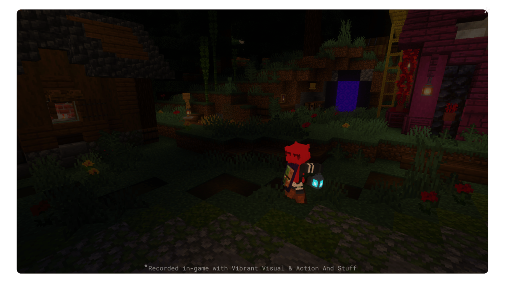
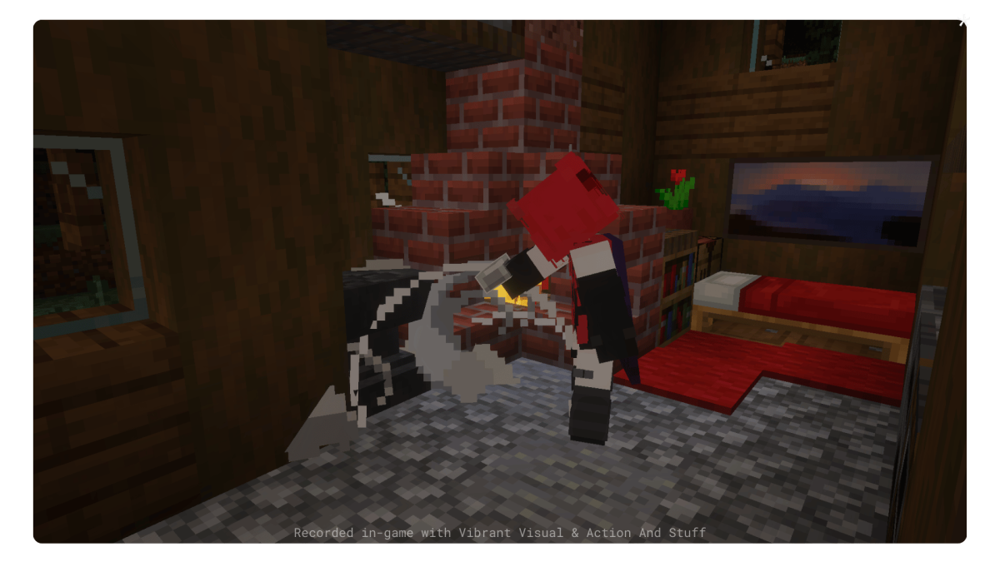

# QoF Quality of Feature

> [!NOTE]
> A Minecraft Bedrock addon that adds small vanilla-friendly features. Each module is configurable through the in-game pack settings panel. Requires **BetaAPIs** enabled under Experiments.

## Table of Contents

- [QoF Quality of Feature](#qof-quality-of-feature)
  - [Table of Contents](#table-of-contents)
  - [Overview](#overview)
  - [Installation](#installation)
  - [Modules](#modules)
    - [Dynamic Light](#dynamic-light)
      - [Light fade soul lantern pickup and drop](#light-fade-soul-lantern-pickup-and-drop)
      - [Fire light flame arrow and burning entities](#fire-light-flame-arrow-and-burning-entities)
      - [Water light boating and diving with a light source](#water-light-boating-and-diving-with-a-light-source)
    - [Anvil Repair](#anvil-repair)
      - [Full repair loop](#full-repair-loop)
    - [Wet Concrete Powder](#wet-concrete-powder)
      - [Conversion in action](#conversion-in-action)
    - [Composter+](#composter)
      - [Hopper integration](#hopper-integration)
      - [Stew and soup bowl return](#stew-and-soup-bowl-return)
    - [Carry Container](#carry-container)
      - [Slowness and double chest](#slowness-and-double-chest)
  - [Configuration Reference](#configuration-reference)
  - [Known Limitations \& Notes](#known-limitations--notes)
  - [License](#license)
  - [Credits](#credits)

## Overview

- [x] Dynamic lighting from held and dropped items
- [x] Repair damaged anvils using iron ingots
- [x] Concrete powder hardens when it touches water as an item
- [x] Composter accepts more items and works with hoppers
- [x] Pick up and carry containers while keeping their contents
- [ ] And many more to comes!

## Installation

1. Download the latest `.mcpack` from [Releases](https://github.com/aitji/QoF-BP/releases).
2. Open the file Minecraft will import it automatically.
3. Create or open a world, go to **Behavior Packs**, and activate **QoF**.
4. Under **Experiments**, enable **Beta APIs**.
5. Launch the world. Settings are available directly in the pack settings panel.

> [!IMPORTANT]
> Beta APIs **must be enabled** or the pack will not function at all.

## Modules

### Dynamic Light
<p align="center">
  
</p>

Held items and dropped item emit light based on their type. Light smoothly fades after the source moves away or is removed. Item frames also contribute light based on whatever is placed inside them.

**How it works:**

- When a player holds or drops a light-emitting item, a `light_block` is placed at the relevant position each tick.
- Light level is calculated from the item's base value multiplied by the reduce factor.
- When the source is gone, light steps down linearly each tick until it reaches zero, then the block is restored to air or water.
- Nearby entities such as Blaze, Glow Squid, Allay, Vex, and Warden also emit light passively.

#### Light fade soul lantern pickup and drop


**alt-message** In a mushroom cave, a soul lantern sits on the ground emitting light. The player walks in from the right, picks it up the room goes dark. And then drop it back in the same spot, then walk away.

#### Fire light flame arrow and burning entities


**alt-message** A flame arrow is fired into a target block. While the arrow burns, it emits light. The player walks through the lit area, picks the arrow up, and leaves. Light disappears when the source is gone.

#### Water light boating and diving with a light source


**alt-message** In the open ocean, the player boats while holding a lantern the water surface glows below. They stop, jump in, switch to a conduit, and swim deeper. The `light_block` is placed inside the water itself, illuminating the seafloor and kelp.


<details>
  <summary><strong>Items that emit light</strong></summary>

| Item | Light Level |
| - | - |
| | <div align="center"><b>Level 15</b></div> |
| beacon | 15 |
| campfire | 15 |
| conduit | 15 |
| ochre_froglight | 15 |
| pearlescent_froglight | 15 |
| verdant_froglight | 15 |
| glowstone | 15 |
| lit_pumpkin | 15 |
| lantern | 15 |
| lava_bucket | 15 |
| sea_lantern | 15 |
| shroomlight | 15 |
| copper_lantern | 15 |
| waxed_copper_lantern | 15 |
| exposed_copper_lantern | 15 |
| waxed_exposed_copper_lantern | 15 |
| weathered_copper_lantern | 15 |
| waxed_weathered_copper_lantern | 15 |
| oxidized_copper_lantern | 15 |
| waxed_oxidized_copper_lantern | 15 |
| | <div align="center"><b>Level 14</b></div> |
| end_rod | 14 |
| glow_berries | 14 |
| torch | 14 |
| copper_torch | 14 |
| | <div align="center"><b>Level 10</b></div> |
| crying_obsidian | 10 |
| soul_campfire | 10 |
| soul_lantern | 10 |
| soul_torch | 10 |
| | <div align="center"><b>Level 7</b></div> |
| enchanting_table | 7 |
| ender_chest | 7 |
| glow_lichen | 7 |
| redstone_torch | 7 |
| | <div align="center"><b>Level 6</b></div> |
| sculk_catalyst | 6 |
| sea_pickle | 6 |
| vault | 6 |
| | <div align="center"><b>Level 5</b></div> |
| amethyst_cluster | 5 |
| | <div align="center"><b>Level 4</b></div> |
| large_amethyst_bud | 4 |
| trial_spawner | 4 |
| | <div align="center"><b>Level 3</b></div> |
| magma | 3 |
| | <div align="center"><b>Level 2</b></div> |
| medium_amethyst_bud | 2 |
| firefly_bush | 2 |
| | <div align="center"><b>Level 1</b></div> |
| brewing_stand | 1 |
| brown_mushroom | 1 |
| calibrated_sculk_sensor | 1 |
| dragon_egg | 1 |
| end_portal_frame | 1 |
| sculk_sensor | 1 |
| small_amethyst_bud | 1 |
</details>

<details>
  <summary><strong>Entities that emit light</strong></summary>

| Entity | Light Level |
| - | - |
| glow_squid | 10 |
| allay | 10 |
| vex | 10 |
| blaze | 12 |
| warden | 6 |
</details>

### Anvil Repair
<p align="center">
  
</p>

Damaged anvils can be repaired by interacting with them while holding an iron ingot. The anvil steps up one stage per ingot consumed.

**Repair chain:**

```
Damaged Anvil  ->  Chipped Anvil  ->  Anvil
```

#### Full repair loop


**alt-message** The player walks into a cozy spruce house, repairs a damaged anvil twice to bring it back to full, mines it with an iron pickaxe, places a new damaged anvil, and walks out.

> [!TIP]
> Hold the interact button to repair continuously. A short delay between repairs is applied to prevent accidental over-use.

<details>
  <summary><strong>Repair item & cost</strong></summary>

| Input | Cost | Output |
| - | - | - |
| damaged_anvil | 1x iron_ingot | chipped_anvil |
| chipped_anvil | 1x iron_ingot | anvil |
| anvil | | not repairable |

---

</details>

### Wet Concrete Powder

Concrete powder item automatically convert to concrete when they enter water. The conversion happens after a short delay proportional to the stack size, and the resulting concrete item inherits the original item's velocity.

**How it works:**

1. When a concrete powder item entity spawns, QoF begins tracking it.
2. Once it enters water, a timer starts larger stacks wait slightly longer.
3. After the timer expires, the powder entity is removed and a concrete item entity is spawned in its place.
4. A particle and sound effect play on conversion.

#### Conversion in action


**alt-message**  Top-down view centered on a water pool with an allay floating nearby emitting soft light. The player walks in from the bottom-center and throws concrete powder into the pool. After a short delay the powder converts, and the player picks up the resulting concrete and walks off.

### Composter+

Expands the composter to accept many more item types not supported in vanilla, including mob drops, cooked food, wool, and various nether materials. Hoppers placed directly above a composter can also feed it automatically.

**How it works:**

1. Player interaction with supported items triggers compost fill with a per-item success chance.
2. On reaching level 7, a short delay passes before the composter becomes ready (level 8).
3. Hoppers check for composting items on a configurable interval and process one item per check.

#### Hopper integration


**alt-message** The player manually composts some string *`(not in the vanilla list)`*, then places a hopper above the composter and throws in rotten flesh *`(also not in the vanilla list)`*. The hopper feeds the composter automatically until it fills and becomes ready.

#### Stew and soup bowl return


**alt-message** Stew and soup items are composted one by one. After each is consumed, an empty bowl is returned in player hand matching the vanilla eating behavior.

> [!WARNING]
> Enabling hopper integration with many composters and hoppers in a loaded area may affect performance. Tune the hopper interval setting if needed.

<details>
  <summary><strong>Additional compostable items (QoF only)</strong></summary>

These are items added by QoF on top of the vanilla compost table. Vanilla items are handled by Minecraft natively and are excluded here to avoid double-processing.

| Item | Success Chance |
| - | - |
| | <div align="center"><b>30%</b></div> |
| podzol | 30% |
| mycelium | 30% |
| rooted_dirt | 30% |
| | <div align="center"><b>50%</b></div> |
| bamboo | 50% |
| dead_bush | 50% |
| honeycomb | 50% |
| sugar | 50% |
| blaze_powder | 50% |
| ghast_tear | 50% |
| string | 50% |
| chicken | 50% |
| porkchop | 50% |
| beef | 50% |
| mutton | 50% |
| rabbit | 50% |
| feather | 50% |
| ink_sac | 50% |
| glow_ink_sac | 50% |
| rabbit_hide | 50% |
| rabbit_foot | 50% |
| frog_spawn | 50% |
| cod | 50% |
| salmon | 50% |
| tropical_fish | 50% |
| pufferfish | 50% |
| | <div align="center"><b>65%</b></div> |
| poisonous_potato | 65% |
| chorus_fruit | 65% |
| resin_clump | 65% |
| lit_pumpkin | 65% |
| rotten_flesh | 65% |
| web | 65% |
| gunpowder | 65% |
| magma_cream | 65% |
| slime_ball | 65% |
| leather | 65% |
| phantom_membrane | 65% |
| cooked_chicken | 65% |
| cooked_porkchop | 65% |
| cooked_beef | 65% |
| cooked_mutton | 65% |
| cooked_rabbit | 65% |
| cooked_cod | 65% |
| cooked_salmon | 65% |
| golden_carrot | 65% |
| glistering_melon_slice | 65% |
| | <div align="center"><b>85%</b></div> |
| blaze_rod | 85% |
| fermented_spider_eye | 85% |
| dried_ghast | 85% |
| black_wool | 85% |
| blue_wool | 85% |
| brown_wool | 85% |
| cyan_wool | 85% |
| gray_wool | 85% |
| green_wool | 85% |
| light_blue_wool | 85% |
| light_gray_wool | 85% |
| lime_wool | 85% |
| magenta_wool | 85% |
| orange_wool | 85% |
| pink_wool | 85% |
| red_wool | 85% |
| purple_wool | 85% |
| white_wool | 85% |
| yellow_wool | 85% |
| popped_chorus_fruit | 85% |
| mushroom_stew | 85% |
| suspicious_stew | 85% |
| beetroot_soup | 85% |
| golden_apple | 85% |
| | <div align="center"><b>100%</b></div> |
| enchanted_golden_apple | 100% |
| rabbit_stew | 100% |
| nether_star | 100% |
</details>

### Carry Container

Allows players to pick up chests and other containers while preserving their contents. Sneaking and interacting with a container picks it up. Placing the carried item puts the container back down with all items restored.

**Behavior while carrying:**

- [x] Slowness is applied continuously.
- [x] Jumping is disabled by default (configurable).
- [x] Jumping in water or lava can be allowed independently.
- [x] Creative mode players are exempt from jump restrictions.

Full carry flow


**alt-message** The player walks in holding a cod, places it inside a barrel, then picks the barrel up. They carry it slowly across the scene slowness visible and place it on top of a hopper. The barrel lands with its contents intact.

#### Slowness and double chest


The player runs in, picks up a chest next to a black sheep, then visibly slows down while carrying it. They walk to a second chest and place theirs beside it, forming a double chest. Contents from both halves are preserved.

> [!WARNING]
> ~~Double chest support is partially implemented. Picking up one half of a double chest will attempt to preserve both halves, but edge cases may result in item loss. Always **back up world** before tranfer the important chests before carrying them.~~ 100% work, We has been extensively tested!

<details>
  <summary><strong>Supported containers</strong></summary>

Any block that has a `minecraft:inventory` component can be picked up. Common examples include:

| Container | Chest support |
| - | - |
| chest | yes |
| trapped_chest | yes |
| barrel | yes |
| hopper | yes |
| dispenser | yes |
| dropper | yes |
| blast_furnace | yes`*` |
| furnace | yes`*` |
| smoker | yes`*` |
| brewing_stand | yes |
| crafter | no |
| Shulker | yes |

> [!NOTE]
> ~~(Shulker boxes, Crafter & Brewing Stand) are also inventory blocks and should work, but have not been extensively tested.~~
> `*` for furnace item will 100% correct, But heat state will be loss.
</details>

## Configuration Reference

All settings are accessible through the pack settings panel in-game. No manual file editing is required.

<details>
  <summary><strong>Full settings table</strong></summary>

| Setting | Key | Type | Default | Description |
|---|---|---|---|---|
| Update interval | `qof:INTERVAL_DELAY` | Slider | `1` | Ticks between each QoF update cycle. Lower is faster. |
| Debug mode | `qof:DEBUG` | Toggle | `false` | Prints verbose logs to chat and console. |
| **Dynamic Light** | | | | |
| Enabled | `qof:LIGHT.ENABLED` | Toggle | `true` | |
| Decay hold ticks | `qof:LIGHT.DECAY_LIGHT_TICK` | Slider | `3` | How long (ticks) a light block persists after the source leaves before fading begins. |
| Reduce factor | `qof:LIGHT.REDUCE_LIGHT` | Slider | `0.7` | Multiplier applied to raw light level. Lower = dimmer. |
| Fade step | `qof:LIGHT.LIGHT_REDUCE_LINEAR` | Slider | `3` | Light levels removed per fade tick. Higher = faster fade. |
| Render radius | `qof:LIGHT.LIGHT_RENDER_RADIUS` | Slider | `32` | Max distance (blocks) to detect light sources around the player. |
| Sources per player | `qof:LIGHT.LIGHT_RENDER_PER_PLAYER` | Slider | `12` | Max number of light-emitting entities processed per player per tick. |
| Fire light level | `qof:LIGHT.LIGHT_FIRE_LEVEL` | Slider | `10` | Base light level emitted by burning entities before the reduce factor is applied. |
| **Anvil Repair** | | | | |
| Enabled | `qof:REPAIR_ANVIL.ENABLED` | Toggle | `true` | |
| Repair hold delay | `qof:REPAIR_ANVIL.REPAIR_HELD_DELAY` | Slider | `7` | Ticks between repeated repair interactions when holding the button. |
| **Wet Concrete Powder** | | | | |
| Enabled | `qof:WET_POWDER_CONCRTE.ENABLED` | Toggle | `true` | |
| Keep velocity | `qof:WET_POWDER_CONCRTE.KEEP_VELOCITY` | Toggle | `true` | Applies the original item velocity to the converted concrete entity. |
| Max process | `qof:WET_POWDER_CONCRTE.MAX_PROCESS` | Slider | `12` | Max concrete powder entities processed per tick batch. |
| **Composter+** | | | | |
| Enabled | `qof:COMPOSTER.ENABLED` | Toggle | `true` | |
| Hopper integration | `qof:COMPOSTER.WORK_WITH_HOPPER` | Toggle | `true` | Allows hoppers facing down into a composter to feed it. |
| Hopper interval | `qof:COMPOSTER.HOPPER_INTERVAL_TICK` | Slider | `8` | Ticks between each hopper-to-composter feed attempt. |
| Ready delay | `qof:COMPOSTER.DELAY_BEFORE_READY` | Slider | `17` | Ticks after reaching level 7 before the composter becomes ready. |
| **Carry Container** | | | | |
| Enabled | `qof:CARRIED_CHEST.ENABLED` | Toggle | `true` | |
| Slowness duration | `qof:CARRIED_CHEST.SLOWNESS_DURATION` | Slider | `10` | Ticks each slowness effect application lasts while carrying. |
| Slowness level | `qof:CARRIED_CHEST.SLOWNESS_AMPLIFIER` | Slider | `2` | Amplifier level of the applied slowness effect. |
| Disable jump | `qof:CARRIED_CHEST.PLAYER_JUMP.NO_JUMP_HOLD_CHEST` | Toggle | `true` | Prevents jumping while carrying a container. |
| Allow jump in water | `qof:CARRIED_CHEST.PLAYER_JUMP.ALLOW_JUMP_IN_WATER` | Toggle | `true` | Exempts water from the jump restriction. |
| Allow jump in lava | `qof:CARRIED_CHEST.PLAYER_JUMP.ALLOW_JUMP_IN_LAVA` | Toggle | `true` | Exempts lava from the jump restriction. |
</details>

## Known Limitations & Notes

> [!NOTE]
> These are known behavioral constraints, not all of which will be fixed in the short term. Most stem from Bedrock scripting API limitations.

**Dynamic Light**

- `Limitations` Light blocks are placed in air or liquid only. Solid blocks are never replaced, which can cause light gaps in tight or enclosed spaces.
- `Limitations` Armor stands do not support the equippable component in the current API. Items held by armor stands do not emit dynamic light only item frames are supported for static placed sources.
- Very high render radius or sources-per-player values will increase tick time noticeably. Keep defaults unless your world has very few active players.

**Anvil Repair**

- The repair consumes the item from the selected hotbar slot within the same tick. If the player switches slots between the interact and the internal run tick, a fallback `/clear` command is used. In very rare cases this fallback may fail silently and reverting the anvil.

**Wet Concrete Powder**

- Conversion time scales with stack size. Very large stacks take longer to process.
- If the item entity is removed before conversion completes (falling into void, despawning, etc.) no concrete is produced and the queue entry is simply cleaned up.

**Composter+**

- Hopper feed processes one item per interval tick. High-throughput automatic farms will be rate-limited by the hopper interval setting.
- `Limitations` We have a system that prevents custom list items from being processed when vanilla items are already being processed. However, if our custom list items are processed first and vanilla items are in the next slots, the vanilla items will be processed at the same time as ours in the hopper.

**Carry Container**

- Double chest carrying is experimental. Items from both halves are preserved through an intermediate entity, but timing edge cases during placement may cause one half to fail to restore.
- Only the player who picked up the container can place it back. Other players cannot interact with the carried item slot.

## License

This project is licensed under the [MIT License](LICENSE).

## Credits

- [aitji](https://github.com/aitji) scripting & design
- [pickerth-12](https://github.com/pickerth-12) design, json & molang

```
©2026 QoF™ Licensed under the MIT License
Made by (aitji & pickerth-12)

  README INFO
Version: v1.2.0
Last updated: 18 Mar 2026
Has README Update: False

  PACK INFO
Last Release: v1.2.0
Last Pre-Release: v1.2.3
Minecraft: 26.0+
Dependencies: ^2.6.0-beta.1.26.3-stable
```